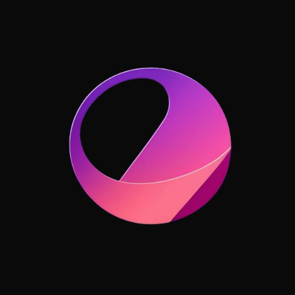

# Voyager

#### My personal chatbot that knows everything about me 🌍🤖

    

        <a href="./docs/README.md">Documentation</a> •
        <a href="./LICENSE">License</a>
    

## 👨‍💻 Author

[Aryan Khurana](https://github.com/AryanK1511)
